```{r setup, include = FALSE}
knitr::opts_chunk$set(cache = TRUE, 
                      echo = TRUE, 
                      message = FALSE, 
                      warning = FALSE,
                      fig.height=6, 
                      fig.width = 1.777777*6,
                      tidy = FALSE, 
                      comment = NA, 
                      highlight = TRUE, 
                      prompt = FALSE, 
                      crop = TRUE,
                      comment = "#>",
                      collapse = TRUE)
knitr::opts_knit$set(width = 60)
library(tidyverse)
library(reshape2)
theme_set(theme_light(base_size = 16))
make_latex_decorator <- function(output, otherwise) {
  function() {
      if (knitr:::is_latex_output()) output else otherwise
  }
}
insert_pause <- make_latex_decorator(". . .", "\n")
insert_slide_break <- make_latex_decorator("----", "\n")
insert_inc_bullet <- make_latex_decorator("> *", "*")
insert_html_math <- make_latex_decorator("", "$$")
```

## Slides, codes and data

* All material prepared with `R`.
* `R Markdown` used to write reproducible material.
* Material available via Github [\alert{here}](https://github.com/LGuery/Bayesian_Workshop_AOTTP).

## Credits

* Workshops material shared by Andy Royle and the Biometrics Working Group [\alert{there}](https://sites.google.com/site/spatialcapturerecapture/workshop-athens-2016) or [\alert{there}](https://sites.google.com/site/spatialcapturerecapture/workshop-tws17)

* Materials shared by [\alert{Olivier Gimenez}](https://github.com/oliviergimenez/Bayesian_Workshop), [\alert{Murray Efford}](https://www.otago.ac.nz/density/pdfs/secr-tutorial.pdf) and \alert{Andy Royle} [\alert{here}](https://www.stat.colostate.edu/graybillconference2014/Presentations/Royle.pdf) and [\alert{there}](https://slideplayer.com/slide/10008078/)

## The Bibles

```{r,  out.width = '35%', fig.align = 'center', echo = FALSE}
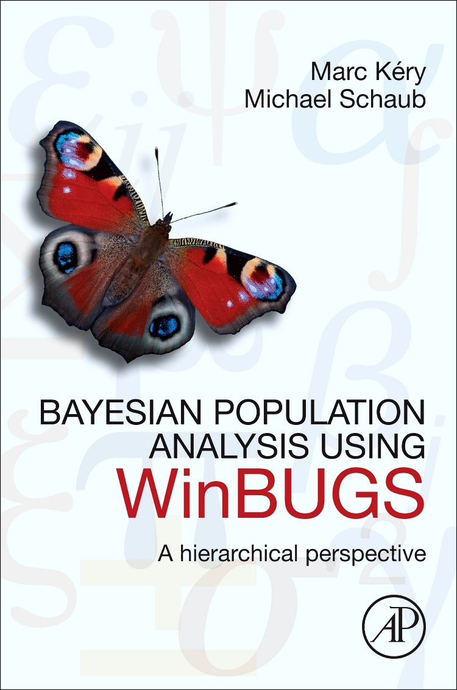
```

## The Bibles

```{r,  out.width = '90%', fig.align = 'center', echo = FALSE}
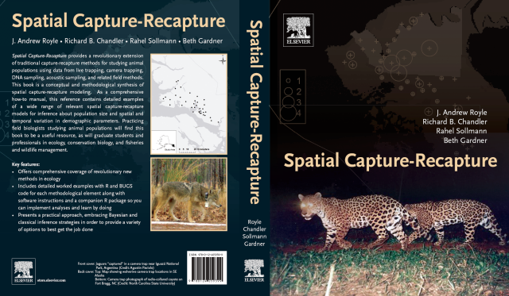
```

## Outline

1. Bayesian Capture-Recapture models in closed population
  * Example 1: Fit Model M0 to the bear data using JAGS and data augmentation

2. Spatially Explicit Capture Recapture (SECR) models
  * Example 2: Fit a basic SECR model in closed population with data augmentation

## JAGS `R` Packages

Many different packages can be used to run JAGS from R such as:

* [\alert{rjags}](https://cran.r-project.org/web/packages/rjags/index.html)

* [\alert{jagsUI}](https://cran.r-project.org/web/packages/jagsUI/index.html)

* [\alert{R2jags}](https://cran.r-project.org/web/packages/R2jags/index.html)

## SECR `R` Packages

Different packages can be used to run SECR models from R such as:

`r insert_inc_bullet()` [\alert{scrbook}](https://sites.google.com/site/spatialcapturerecapture/) from the [\alert{Spatial Capture-Recapture} book](https://books.google.fr/books?hl=fr&lr=&id=RO08-S-amZMC&oi=fnd&pg=PR1&dq=spatial+capture+recapture+book&ots=e8zwMmCF3G&sig=oi804aeL6cfrvwaAueo1NpNLNp0#v=onepage&q=spatial%20capture%20recapture%20book&f=false) by Andy Royle, Richard Chandler, Rahel Sollmann and Beth Gardner

`r insert_inc_bullet()`  [\alert{secr}](https://cran.r-project.org/web/packages/secr/index.html) developped by Murray Efford

`r insert_inc_bullet()`  [\alert{oSCR}](https://sites.google.com/site/spatialcapturerecapture/oscr-package) developed by Chris Sutherland, Andy Royle, and Dan Linden

# Bayesian Capture-Recapture models in closed population

## Capture-recapture, quésako?

`r insert_inc_bullet()` Information on N or density D is the main interest.
`r insert_inc_bullet()` Only a sample of individuals n is observed due to an encounter or detection probability p.
`r insert_inc_bullet()` To estimate or model p, studies to generate encounter history information are conducted.
`r insert_inc_bullet()` The statisitcal models to describe these encounter histories are capture-recapture (CR) models. 

## Individual encounter probability

```{r,  out.width = '65%', fig.align='center',echo=FALSE}
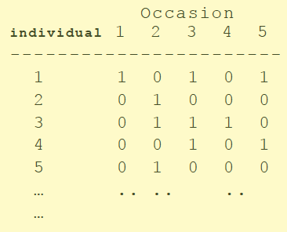
```

## Starting point of CR

`r insert_inc_bullet()`  Random sampling of individuals: detection is a Bernoulli trial (binomial distribution)
`r insert_inc_bullet()` CR models are, one way or another, logistic regression models or GLMs where N is unknown.
`r insert_inc_bullet()` Status of individuals is not known. You don't observe "all zero encounter histories".
`r insert_inc_bullet()` Initial CR models developped for geographically closed populations.
`r insert_inc_bullet()` Heterogeneity in p is important (bias in N) and CR models are all about modeling variation in p (Otis et al. 1978)

## Closed population

`r insert_inc_bullet()` Demographic closure (no births, no deaths) and geographical closure (no entry, no exit)

* Closed models characterization (Otis *et al.* 1978):
   * M0 = “the null model”, p is constant in all dimensions
   * Mt = p is a function of sample occasion , p(t)
   * Mb = behavioral response model. Trap happiness or shyness
   * Mh = individual heterogeneity
   * Mbt = time + behavior, or time*behavior
   * Mbh, Mth, Mbth
   
`r insert_inc_bullet()` See [\alert{Kery and Schaub (2012)}](https://books.google.fr/books?id=kd4JGs44ap4C&printsec=frontcover&hl=fr&source=gbs_ge_summary_r&cad=0#v=onepage&q&f=false) Chapter 6 to go further

## Basic model M0

`r insert_inc_bullet()` Model M0 can be considered as a null model

* The main assumptions are:
  * p is constant for all sample occasions and all individuals
  * Encounters are independent among and within individuals

`r insert_inc_bullet()` Encounter observations are Bernoulli random variables
`r insert_inc_bullet()` Close to a binomial GLM or logistic regression but where N, size of some ideal data set, is unknown

## N unknown, so what?

`r insert_inc_bullet()` If N is known, Model M0 is a logistic regression.

```{r, eval=FALSE}
model{
  p ~ dunif(0,1)
  for (i in 1:N){
    y[i] ~ dbin(p,K)
  }
}
```

`r insert_inc_bullet()` But N is not known. Why couldn't we put a prior on N (e.g. N ~ dunif(0, 1000)) and analyze the model using standard methods of MCMC?

`r insert_inc_bullet()` Because N would be a parameter of the model and would be updated in the MCMC algorithm. The size of the data set would have to change, which is not possible with JAGS

## Data augmentation (DA), see [\alert{Royle and Dorazio paper}](https://www.researchgate.net/publication/226464578_Parameter-expanded_data_augmentation_for_Bayesian_analysis_of_pture_models)

`r insert_inc_bullet()` *Concept underlying DA is adding “observations” to create a dataset composed of a known number of individuals.*
`r insert_inc_bullet()` *For CR models, addition of a set of “all zero” encounter histories which are not observable in practice.* 
`r insert_inc_bullet()` *The model of the augmented dataset is a zero-inflated version of either a binomial or a multinomial base model.* 
`r insert_inc_bullet()` *Their use of DA provides a general approach for analyzing both closed and open population models of all types.*

## DA and dataset
```{r,  out.width = '65%', fig.align='center',echo=FALSE}

```

# Example 1: Fit Model M0 to the bear data using JAGS and data augmentation

Material extracted from the day 1 of the SCR workshop in Athens in 2016 available [\alert{here}](https://sites.google.com/site/spatialcapturerecapture/workshop-athens-2016/day-1)

## Instructions

<!-- # you can run this exercise by typing example(beardata) -->
* Install the package scrbook [\alert{there}](https://sites.google.com/site/spatialcapturerecapture/scrbook-r-package) and get the bear data

```{r, eval=TRUE, echo=TRUE}
library(scrbook)
data(beardata)
```

## Analysis of the Fort Drum bear data

* Hair snare study
  * J = 38 hair snares
  * K = 8 weeks of sampling
  * n = 47 individuals captured

```{r,  out.width = '30%', fig.align='center',echo=FALSE}
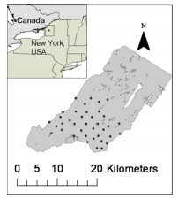
```

## Step 1: Create a text file with the model description, written in the BUGS language

```{r, eval=TRUE, echo=TRUE}
cat("
model {
psi ~ dunif(0, 1) # DA parameter
p ~ dunif(0,1) # prior distribution
for (i in 1:M){
   z[i] ~ dbern(psi) # binary DA latent variables which indicates if individual i is
                     # a member of the population - Abundance is just the sum of 
                     # these binary latent variables
   for(k in 1:K){
     tmp[i,k] <- p*z[i]
     y[i,k] ~ dbin(tmp[i,k],1) # likelihood
      }
     }
N <- sum(z[1:M])
}
",file="code/modelM0.txt")
```

## Step 2: Store the different values of interest

```{r}
M = 175 # number of all individuals (encountered and DA)
nind <- dim(beardata$bearArray)[1] # number of encounter histories (individuals)
ntraps <- dim(beardata$bearArray)[2] # number of traps
K <- dim(beardata$bearArray)[3] # number of occasions

# How many "all zero" encounter histories are there?
nz <- M-nind

nz
```

## Step 3: Set up the data augmentation and create the 2-d matrix "individual x occasions"

```{r, eval=TRUE, echo=TRUE} 
# Fill up an array with zeros
Yaug <- array(0, dim=c(M,ntraps,K))

# Store the real data into the first nind slots
Yaug[1:nind,,] <- beardata$bearArray

# Because traditional CR models ignore space create a 2-d matrix 
# "individuals x occasions"  of 0/1 data where 1 = "captured" 0 = "not captured"

y <- apply(Yaug,c(1,3),sum) # summarize by ind * occ
y[y>1] <- 1                 # make sure that multiple encounters do not occur
```

## Step 4: Set input and output

* Format your data in R as a named list

```{r, eval=TRUE, echo=TRUE}
set.seed(2020)
data <- list(y=y,M=M,K=K)
```

* Make an object containing the names of the parameters that
you are interested in

```{r, eval=TRUE, echo=TRUE}
params <- c("psi","p","N")
```

## Step 5: Initial values

* Create a function to generate random initial values

```{r, eval=TRUE, echo=TRUE}
zst = c(rep(1,nind),rbinom(M-nind, 1, .5))
inits =  function(){list(z=zst, psi=runif(1), p=runif(1))}
```

## Step 6: Run

* Compile the model and obtain posterior samples

```{r, eval=FALSE, echo=TRUE}
# Package rjags
library(rjags)
jm <- jags.model("code/modelM0.txt", data=data, inits=inits, n.chains=3, n.adapt=1000)
fit0j <- coda.samples(jm, params, n.iter=1000)

# Package jagsUI
library(jagsUI)
fit0j = jags(data, inits, params, model.file="code/modelM0.txt",n.chains=3,
              n.iter=2000, n.burnin=1000, n.thin=1)
```

```{r, eval=TRUE, echo=FALSE, include=FALSE}
library(rjags)
jm <- jags.model("code/modelM0.txt", data=data, inits=inits, n.chains=3, n.adapt=1000)
fit0j <- coda.samples(jm, params, n.iter=1000)
```

## Results: summary

```{r, eval=FALSE, echo=FALSE}
summary(fit0j)
```

```{r,  out.width = '70%', fig.align = 'center', echo = FALSE}
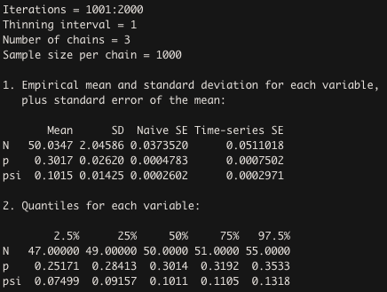
```

## Results: plot

```{r, eval=TRUE, echo=FALSE}
plot(fit0j[,c("N","psi")])
```

## Your turn

`r insert_inc_bullet()` Try different values of M: 50 and 400.
`r insert_inc_bullet()` Compare estimates (with summary function)
`r insert_inc_bullet()` Make a plot of the posterior distribution of N for both of them

## Solution M = 50

```{r, eval=FALSE, echo=FALSE}
library(scrbook)
data(beardata)
cat("
model {
psi ~ dunif(0, 1)
p ~ dunif(0,1)
for (i in 1:M){
   z[i] ~ dbern(psi)
   for(k in 1:K){
     tmp[i,k] <- p*z[i]
     y[i,k] ~ dbin(tmp[i,k],1)
      }
     }
N<-sum(z[1:M])
}
",file="code/modelM0.txt")
M = 400
nind <- dim(beardata$bearArray)[1]
ntraps <- dim(beardata$bearArray)[2]
K <- dim(beardata$bearArray)[3]
Yaug <- array(0, dim=c(M,ntraps,K))
Yaug[1:nind,,] <- beardata$bearArray
y <- apply(Yaug,c(1,3),sum)
y[y>1] <- 1
set.seed(2013)
data <- list(y=y,M=M,K=K)
params <- c("psi","p","N")
zst = c(rep(1,nind),rbinom(M-nind, 1, .5))
inits =  function(){list(z=zst, psi=runif(1), p=runif(1))}
jm <- jags.model("code/modelM0.txt", data=data, inits=inits, n.chains=3, n.adapt=1000)
fit0j <- coda.samples(jm, params, n.iter=1000)
summary(fit0j)
plot(fit0j[,"N"])
```

```{r,  out.width = '70%', fig.align = 'center', echo = FALSE}
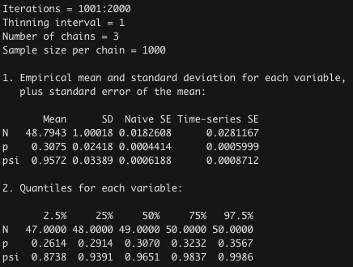
```

## Solution M = 400

```{r,  out.width = '70%', fig.align = 'center', echo = FALSE}
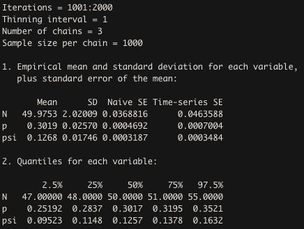
```

# Spatially Explicit Capture Recapture (SECR) models

## Some references

`r insert_inc_bullet()` Efford (2004): initial idea, ad hoc simulation based approach

`r insert_inc_bullet()` Likelihood-based approaches: Borchers and Efford (2008), Efford *et al.* (2008, 2009)

`r insert_inc_bullet()` Hierarchical MCMC approach: Royle and Young (2008), Royle *et al.* (2009*ab*), Royle and Gardner (2010), Gardner *et al.* (2009, 2010)

## Why SECR models?

`r insert_inc_bullet()` New technologies producing vast quantities of encounter history data

`r insert_inc_bullet()` Camera traps

`r insert_inc_bullet()` DNA sampling (Scat picked up by searching space, Urine on scent sticks or in snow, Tissue samples from treed individuals, Hair snares)

`r insert_inc_bullet()` Acoustic sampling (whales, birds, bats)

```{r,  out.width = '70%', fig.align = 'center', echo = FALSE}
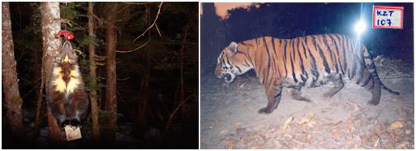
```

## Main Goals

`r insert_inc_bullet()` Extension of CR to make use of encounter location data in order to study spatial aspects of animal populations

`r insert_inc_bullet()` Examples: spatial variation in animal density, resource selection or animal movement

`r insert_inc_bullet()` Models developed to deal explicitly with 2 main problems associated with density estimation in trapping studies

`r insert_inc_bullet()` 1 -Unknown sample area varies with trap layout – home range size

`r insert_inc_bullet()` 2- Heterogeneity in capture probability associated with animal location relative to traps 

## Spatial point process model

`r insert_inc_bullet()` Spatial distribution of organisms is naturally described by point process models
`r insert_inc_bullet()` In the CR context, Efford (2004, Oikos) described two concepts: the biological or state process and the observation process

## Concept 1: Biological or state process

Describe how individuals are distributed in space = a point process model for “activity centers” or home range centers

`r insert_inc_bullet()` $s_{i} =$ coordinates of the activity center or home range center for individual i

`r insert_inc_bullet()` ${s_{1}, s_{2}, ..., s_{N}} =$ realization of a point process

`r insert_inc_bullet()` $s_{i} \sim Uniform(S); S =$ state-space of point process, i.e. the spatial region where the N activity centers occur

```{r,  out.width = '60%', fig.align = 'center', echo = FALSE}
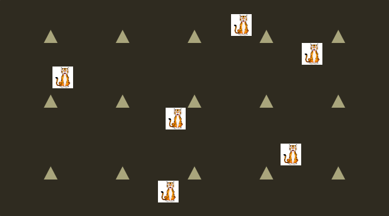
```

## Concept 2: Observation process

Describe P(encounter in trap) conditional on where an individual lives ($s_{i}$)

`r insert_inc_bullet()` $y_{i,j} | s_{i} \sim Bern( p(x_{j}, s_{i}) )$

`r insert_inc_bullet()` $x_{j} = trap location$

`r insert_inc_bullet()` $p(x_{j}, s_{i}) = p_{0} * exp (- d_{ij}^{2}(x_{j}, s_{i})/\sigma^2)$

`r insert_inc_bullet()` $d_{ij} = || s_{i}–x_{j} || =  \sqrt{(s_{1i}–x_{1i})^2  + (s_{2i}–x_{2i})^2}$

## Concept 2: Observation process
```{r,  out.width = '100%', fig.align = 'center', echo = FALSE}
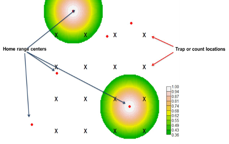
```

## Concept 2: Observation process

```{r, eval=TRUE,echo=FALSE}
plot(function(d) 0.7*exp(-d^2/(2*20^2)), cex.lab=1.3,
     from=0, to=100, ylim=c(0,1), main="",
     xlab="Distance (m) between activity center and trap",
     ylab="Detection probability", lwd=2)
plot(function(d) 0.7*exp(-d^2/(2*30^2)), 0, 100, add=TRUE, col="blue",
     lwd=2)
plot(function(d) 0.7*exp(-d^2/(2*40^2)), 0, 100, add=TRUE, col="orange",
     lwd=2)
legend(50, 1, c("p0=0.7, sigma=20", "p0=0.7, sigma=30", "p0=0.7, sigma=40"),
       lty=1, lwd=2, col=c("black", "blue", "orange"))
```

## Distributions for observation model

`r insert_inc_bullet()` Binomiale (hare snare): The individual can be encountered maximum once in each trap but in different traps in the same occasion

`r insert_inc_bullet()` Multinomiale (physical capture): The individual can be encountered maximum once in one trap in each occasion

`r insert_inc_bullet()` Poisson (camera trap): The individual can be encountered several times by trap in each occasion occasion

## Inference for SCR models

`r insert_inc_bullet()` SCR models are GLMMs where N is unknown

`r insert_inc_bullet()` MLE based on marginal likelihood: Borchers, D.L. and M.G. Efford. 2008. Spatially explicit maximum likelihood methods for capture-recapture studies. Biometrics 64:377-385 -> `R` package ‘secr’ (M.G. Efford)

`r insert_inc_bullet()` Bayesian Analysis by MCMC (data augmentation): Royle, J.A. and K.Y. Young. 2008. A hierarchical model for spatial capture-recapture data. Ecology 89:2281-2289.

# Example 2: Fit a basic SECR model in closed population with data augmentation

## Instructions

* Import the encounter history data

```{r, eval=TRUE, echo=FALSE}
encounters <- read.csv("dat/encounterData.csv")
encounters[1:4,] # First 4 rows of data
```

* Import trap coordinates

```{r, eval=TRUE, echo=FALSE}
traps <- read.csv("dat/trapData.csv", row.names=1)
traps[1:4,] # First 4 rows of data
```

## Step 0: Create 3D capture history array using the table function

Add missing traps and occasions in the levels to have a complete 3D array and order
```{r, eval=TRUE, echo=TRUE}
nocapTraps <- setdiff(rownames(traps), encounters$trapID)
nocapTraps
levels(encounters$trapID) <- c(levels(encounters$trapID), nocapTraps)
levels(encounters$trapID) # All trapIDs should be here now

y3D <- table(encounters$animalID, encounters$trapID,
             encounters$occasion)
```

## Step 0: Create 3D capture history array using the table function

Add missing traps and occasions in the levels to have a complete 3D array and order
```{r, eval=TRUE, echo=TRUE}
y3D[1:4,1:10,1] ## Data on first 4 ind at first 10 trap on k=1

all(rownames(traps)==colnames(y3D))  ## Not good
y3D <- y3D[,rownames(traps),]        ## Re-order
all(rownames(traps)==colnames(y3D))  ## Good
```

## Step 1: Create a text file with the model description

```{r, eval=TRUE, echo=FALSE}
cat("
model {
p0 ~ dunif(0, 1) # baseline encounter probability
sigma ~ dunif(0, 2) # scale parameter of encounter function
psi ~ dunif(0, 1) # DA parameter: E(N) = M*psi

for(i in 1:M) {
z[i] ~ dbern(psi) # Is individual real?
s[i,1] ~ dunif(xlim[1], xlim[2]) # x-coordinate of activity center
s[i,2] ~ dunif(ylim[1], ylim[2]) # y-coordinate

for(j in 1:J) {
# dist between activity center and trap
d[i,j] <- sqrt((s[i,1] - x[j,1])^2 + (s[i,2] - x[j,2])^2)
p[i,j] <- p0*exp(-d[i,j]^2/(2*sigma^2)) # capture prob at trap j

for(k in 1:K) {
y[i,j,k] ~ dbern(p[i,j]*z[i]) # model for data
}
}
}
N <- sum(z) # realized abundance
EN <- M*psi # expected abundance
A <- (xlim[2]-xlim[1])*(ylim[2]-ylim[1]) # area of state-space
D <- N/A # realized density
ED <- EN/A # expected density
}
",file="code/SECR0.txt")
```

```{r, eval=FALSE, echo=TRUE}
cat("
model {
p0 ~ dunif(0, 1) # baseline encounter probability
sigma ~ dunif(0, 2) # scale parameter of encounter function
psi ~ dunif(0, 1) # DA parameter: E(N) = M*psi

for(i in 1:M) {
z[i] ~ dbern(psi) # Is individual real?
s[i,1] ~ dunif(xlim[1], xlim[2]) # x-coordinate of activity center
s[i,2] ~ dunif(ylim[1], ylim[2]) # y-coordinate

for(j in 1:J) {
# dist between activity center and trap
d[i,j] <- sqrt((s[i,1] - x[j,1])^2 + (s[i,2] - x[j,2])^2)
p[i,j] <- p0*exp(-d[i,j]^2/(2*sigma^2)) # capture prob at trap j

...

",file="code/SECR0.txt")
```

## Step 1: Create a text file with the model description

```{r, eval=FALSE, echo=TRUE}
cat("
...

for(k in 1:K) {
y[i,j,k] ~ dbern(p[i,j]*z[i]) # model for data
}
}
}

N <- sum(z) # realized abundance
EN <- M*psi # expected abundance
A <- (xlim[2]-xlim[1])*(ylim[2]-ylim[1]) # area of state-space
D <- N/A # realized density
ED <- EN/A # expected density
}
",file="code/SECR0.txt")
```

## Step 2: Store the different values of interest

```{r}
M <- 50 # number of all individuals (encountered and DA)
J <- dim(y3D)[2] # number of traps
K <- dim(y3D)[3] # number of occasions
n0 <- nrow(y3D) # number of encounter histories, i.e. encountered individuals
```

## Step 3: Set up the data augmentation

```{r, eval=TRUE, echo=TRUE} 
# Fill up an array with zeros
yz <- array(0, c(M, J, K))

# Store the real data into the first nind slots
yz[1:n0,,] <- y3D
```

## Step 4: Set input and output

 * Format your data in R as a named list

```{r, eval=TRUE, echo=TRUE}
set.seed(2020)
jd <- list(y=yz, J=J, K=K, M=M, x=traps, xlim=c(0,1), ylim=c(0,1))
```

* Make an object containing the names of the parameters that
you are interested in

```{r, eval=TRUE, echo=TRUE}
jp <- c("N", "p0", "sigma")
```

## Step 5: Initial values

* Create a function to generate random initial values

```{r, eval=TRUE, echo=TRUE}
ji <- function() list(z=rep(1,M), p0=runif(1), sigma=runif(1))
```

## Step 6: Run

* Compile the model and obtain posterior samples

```{r, eval=TRUE, echo=TRUE}
# Package rjags
library(rjags)
jm <- jags.model("code/SECR0.txt", jd, ji, n.chains=1, n.adapt=1000)
jc <- coda.samples(jm, jp, 1000)
```

## Results: summary

```{r, eval=FALSE, echo=FALSE}
summary(jc)
```

```{r,  out.width = '70%', fig.align = 'center', echo = FALSE}
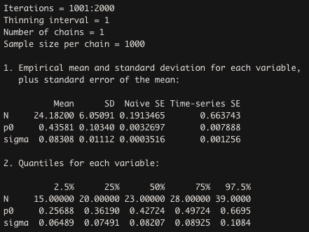
```

## Results: plot

```{r, eval=TRUE, echo=FALSE}
plot(jc)
```

## Your turn

## More complex model

`r insert_inc_bullet()` Open population ouverte (survival, recruitment…)
`r insert_inc_bullet()` Time and/or sex effect
`r insert_inc_bullet()` Variation in effort, e.g. duration of trap activity
`r insert_inc_bullet()` Habitat mask
`r insert_inc_bullet()` Mobile activity centers
`r insert_inc_bullet()` Mixing count data with SECR data

<!-- # Generate R code only -->
```{r, eval=FALSE} 
knitr::purl('BayesianCR_LGuery.Rmd')
```
